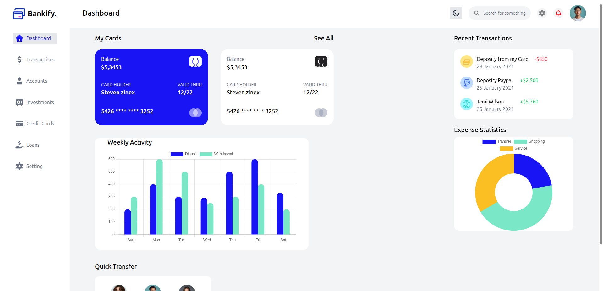
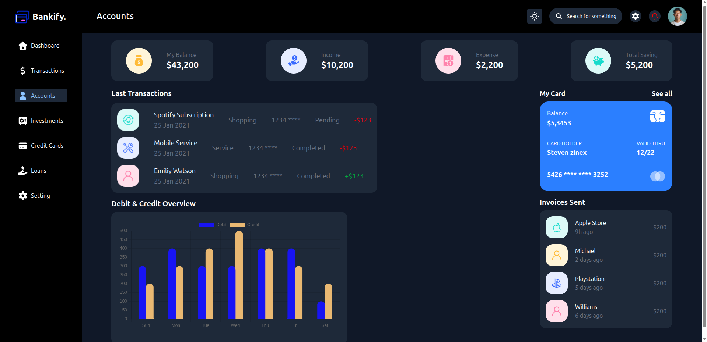

# Bankify

A modern, responsive, and feature-rich banking dashboard built with Next.js 15, Tailwind CSS, and React. Bankify provides a seamless digital banking experience with beautiful UI, interactive charts, and real-time account management.

[Live Demo → bankify-two.vercel.app](https://bankify-seven.vercel.app/)

---

## ✨ Features

- **Modern Dashboard:** Clean, intuitive interface for all your banking needs
- **Account Overview:** View balances, income, expenses, and savings at a glance
- **Quick Transfers:** Instantly transfer funds between accounts
- **Transaction History:** Detailed, filterable transaction lists
- **Cards Management:** Manage debit/credit cards, settings, and security
- **Investments:** Track trending stocks and your investment portfolio
- **Loans:** Monitor active loans and repayment schedules
- **Settings:** Personalize your banking experience
- **Dark/Light Theme:** Automatic theme detection and instant switching
- **Responsive Design:** Works perfectly on desktop, tablet, and mobile

---

## 🚀 Tech Stack

- [Next.js 15](https://nextjs.org/) (App Router)
- [React 19](https://react.dev/)
- [Tailwind CSS](https://tailwindcss.com/)
- [TypeScript](https://www.typescriptlang.org/)
- [Vercel](https://vercel.com/) (Deployment)

---

## 📦 Getting Started

1. **Clone the repository:**
   ```bash
   git clone https://github.com/Kingestif/Bankify.git
   cd Bankify
   ```
2. **Install dependencies:**
   ```bash
   pnpm install
   ```
3. **Run the development server:**
   ```bash
   pnpm dev
   ```
4. **Open [http://localhost:3000](http://localhost:3000) in your browser.**

---

## 🖼️ Screenshots


---

## 🛠️ Folder Structure

```
app/
  dashboard/
    accounts/
    cards/
    investments/
    loans/
    setting/
    transactions/
  lib/
  ui/
public/
```

---

## 🌐 Deployment

Bankify is deployed on [Vercel](https://vercel.com/):

🔗 **[https://bankify-seven.vercel.app/](https://bankify-seven.vercel.app/)**

---

## 🤝 Contributing

Contributions, issues, and feature requests are welcome!

1. Fork the repo
2. Create your feature branch (`git checkout -b feature/YourFeature`)
3. Commit your changes (`git commit -m 'Add some feature'`)
4. Push to the branch (`git push origin feature/YourFeature`)
5. Open a pull request

---

## 📄 License

MIT License. See [LICENSE](LICENSE) for details.

---

## 👤 Author

- [Kingestif](https://github.com/Kingestif)

---

> Modern banking, made simple. Enjoy Bankify!
